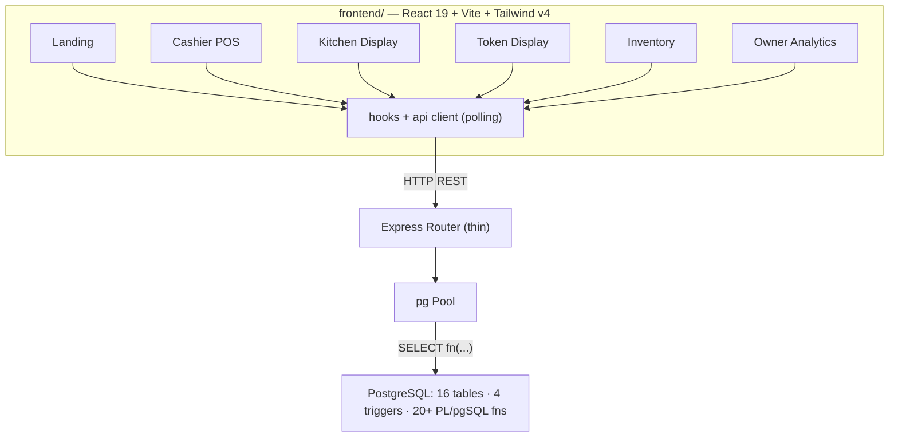

# OvenFresh CDS — Full-Stack Implementation Plan (v2)

## Goal

Build the complete OvenFresh CDS application using the PERN stack (PostgreSQL,
Express, React, Node.js). Core principle: **all business logic lives in
PostgreSQL functions/triggers** — the Express backend is a thin REST layer that
calls those functions and returns JSON. The React frontend consumes the API.

> [!IMPORTANT]
> **v2 revision.** The original plan assumed an existing `ovenfresh-cds/`
> frontend from another machine. That code is **not in this repository** — this
> repo contains only `database/`, `ui-prompts/`, and this plan. So the frontend
> is built from scratch here, following the `ui-prompts/` spec pack
> (`00-design-system.md` … `06-landing-page.md`), which produces a better,
> industry-standard POS UI than the old code anyway.

--------

## Current State

| Layer               | Status      | Details                                              |
|---------------------|-------------|------------------------------------------------------|
| Database DDL        | ✅ Complete | 16 tables in `database/ddl/01_tables.sql`            |
| Triggers            | ✅ Complete | order status timestamp, purchase stock update, batch deduction, sale stock deduction |
| PL/pgSQL Functions  | ✅ Complete | 20+ functions across 8 files                         |
| Seed Data           | ✅ Complete | `database/seed/01_seed_data.sql`                     |
| Backend             | ❌ Missing  | Built at `backend/`                                  |
| Frontend            | ❌ Missing  | Built at `frontend/` from the `ui-prompts/` spec pack |

--------

## Decisions (previously "open questions" — now locked)

1. **PERN, not MERN** — triggers, cursors, and PL/pgSQL require PostgreSQL. ✔
2. **No chart library.** The dashboard's charts are simple bars / stacked bars /
   horizontal bar lists. These are hand-rolled with SVG/flex divs (~0KB added,
   pixel-perfect control, obeys the "single hue, no pies, no dual axes" chart
   rules in `05-owner-analytics.md`). Recharts dropped — better UI, lighter app.
3. **Polling, not WebSockets.** KDS / Token Display / POS poll every 3–5s. For a
   DBMS-focused project this is simpler and perceived latency is fine.
4. **No authentication.** The landing "Login" affordance is decorative; screens
   are directly reachable. (Out of scope for the DBMS project.)
5. **Monorepo layout**: `backend/` + `frontend/` side by side with `database/`
   in this repo — one repo holds the whole project.
6. **Light mode only**, palette + type scale exactly per `00-design-system.md`
   (`#F8F6F3` paper, `#1A1A1A` primary, `#C8A87C` gold accent, Inter +
   JetBrains Mono).

--------

## Architecture



> [!IMPORTANT]
> Express routes contain **no business logic** — each handler calls a PL/pgSQL
> function (`SELECT * FROM create_order(...)`) or, where no function exists
> (simple lookups/inserts on `vendor`, `purchase_order`, `raw_material`…), a
> single direct SQL statement whose side-effects are still enforced by triggers.

--------

## Backend — `backend/`

Express 5 + TypeScript + `pg`. Files: `package.json`, `tsconfig.json`,
`.env(.example)`, `src/db.ts`, `src/server.ts`, six route modules.

### Endpoints → PL/pgSQL mapping

| Route | Function / SQL |
|---|---|
| `GET /api/products` | `get_cashier_products()` |
| `GET /api/products/batches` | `get_active_batches()` |
| `GET /api/customers/search?phone=` / `?idType=&idNumber=` | `find_customer_by_phone` / `find_customer_by_id` |
| `POST /api/customers/register` | `register_customer(...)` |
| `GET /api/customers/:id/active-orders` | `get_active_orders(id)` |
| `POST /api/orders` | `create_order(customer, payment, dine, items_json)` |
| `PATCH /api/orders/:id/status` | direct `UPDATE customer_order SET status` (trigger stamps timestamp; sale-deduction trigger fires on completion path) |
| `GET /api/orders/board` | direct `SELECT` of paid/preparing/ready orders + kitchen items — feeds KDS & Token Display (`get_kitchen_orders()` alone omits `ready` tickets) |
| `POST /api/orders/mark-abandoned` | `mark_abandoned_orders()` cursor |
| `GET /api/kitchen/requests` · `POST /api/kitchen/requests` · `PATCH /api/kitchen/requests/:id` | `get_pending_requests` / `create_kitchen_request` / `respond_to_kitchen_request` |
| `GET /api/kitchen/requests/:id` | direct `SELECT` on `kitchen_request` (POS polls for approve/reject resolution) |
| `POST /api/kitchen/batches` · `PATCH /api/kitchen/batches/:id/status` | `create_batch` / `update_batch_status` |
| `GET /api/inventory/raw-materials` · `/ready-made-stock` · `/daily-stock` · `/vendors` · `/purchase-orders` · `/stockout-log` · `/waste-log` | direct `SELECT`s (joins where needed) |
| `POST /api/inventory/purchase-orders` | direct `INSERT` PO + lines (stock/wavg triggers fire) |
| `POST /api/inventory/vendors` | direct `INSERT` vendor + phone |
| `POST /api/inventory/stockout` | `record_stockout(item, qty)` |
| `POST /api/inventory/waste` | direct `UPDATE` daily stock / stock deduction with cost log |
| `POST /api/inventory/daily-stock/init` · `/end-of-day` | `init_daily_stock` / `end_of_day_waste` |
| `GET /api/analytics/profit` · `/top-sellers` · `/top-requested` · `/waste` · `/peak-hours` · `/vendor-performance` · `/preparation-report` | matching `get_*` functions |
| `POST /api/analytics/stock-recommendation` | `calculate_stock_recommendation(item, weeks)` |

**Periodic task:** `setInterval` in `server.ts` runs
`SELECT mark_abandoned_orders()` every 15 min; `init_daily_stock()` runs once at
server startup.

--------

## Frontend — `frontend/`

Vite + React 19 + TypeScript + Tailwind CSS v4 + React Router. No global
mock-data store: a small `api/client.ts` fetch wrapper + a `usePolling` hook;
each screen owns its data (matches the "all state from the store" spirit with
live server state).

```
frontend/src/
├── api/client.ts            # apiGet/apiPost/apiPatch
├── hooks/usePolling.ts      # interval re-fetch with visibility pause
├── types.ts                 # DTOs mirroring the PL/pgSQL return shapes
├── components/ui/           # Button, StatusBadge, StatTile, DataTable,
│                            # Modal, EmptyState, SearchInput, Toast
├── pages/
│   ├── Landing.tsx          # per 06-landing-page.md
│   ├── pos/CashierPOS.tsx   # per 01-cashier-pos.md (+ Catalog, Ticket,
│   │                        #   CustomerStrip, ParkedDrawer, PayModal)
│   ├── kitchen/KitchenDisplay.tsx  # per 02-kitchen-display.md (+ TicketCard,
│   │                        #   EscalationRail, BatchRail)
│   ├── token/TokenDisplay.tsx      # per 03-token-display.md
│   ├── inventory/Inventory.tsx     # per 04-inventory.md (4 tabs)
│   └── analytics/OwnerDashboard.tsx # per 05-owner-analytics.md
│                            #   (KPI strip, sales bars, top sellers,
│                            #    payment/dine mix, missed demand, vendor spend)
└── App.tsx                  # routes: / /pos /kitchen /tokens /inventory /analytics
```

**Chart palette** (analytics): single-hue gold for magnitude bars; the two-hue
categorical pair (cash vs mobile, dine-in vs takeaway) is validated for
colorblind separation with the dataviz validator before shipping.

--------

## Execution Order

| Step | What |
|---|---|
| 1 | Update this plan ✔ |
| 2 | Backend scaffolding + all 6 route modules |
| 3 | Frontend scaffolding (Vite, Tailwind v4, fonts, router) |
| 4 | Shared UI components |
| 5 | Landing → POS → KDS → Token → Inventory → Analytics |
| 6 | Periodic tasks, typecheck + build both apps |

--------

## Verification

```bash
# 1. Database
psql -d cds_database -f database/run_all.sql

# 2. Backend
cd backend && npm install && npm run dev
curl http://localhost:3001/api/products

# 3. Frontend
cd frontend && npm install && npm run dev   # http://localhost:5173
npm run build                               # type + bundle check
```

Manual flows: POS order → appears on KDS → bump to ready → token board updates
→ serve; escalation round-trip POS↔KDS; purchase order → trigger-updated stock
visible in Inventory; analytics cards populated from seed + new orders.
