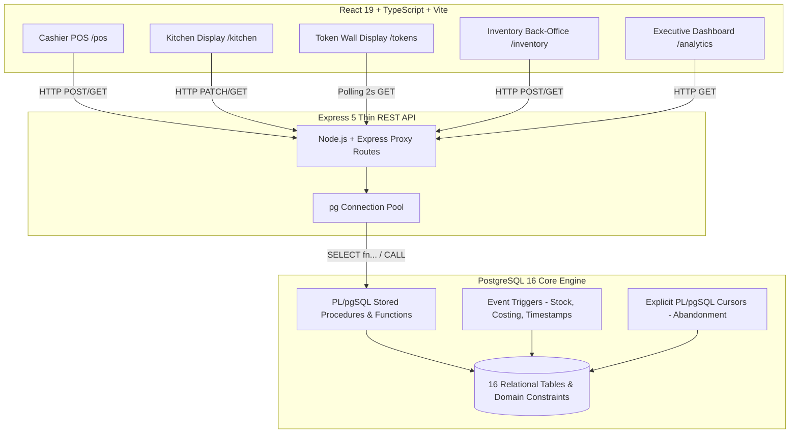
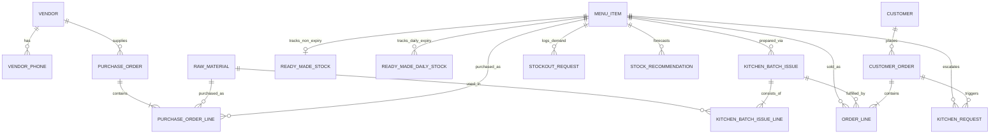
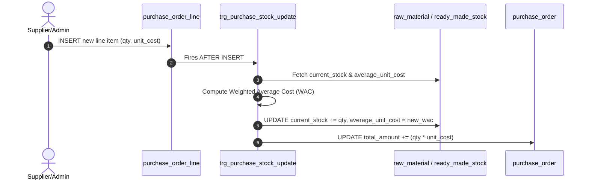
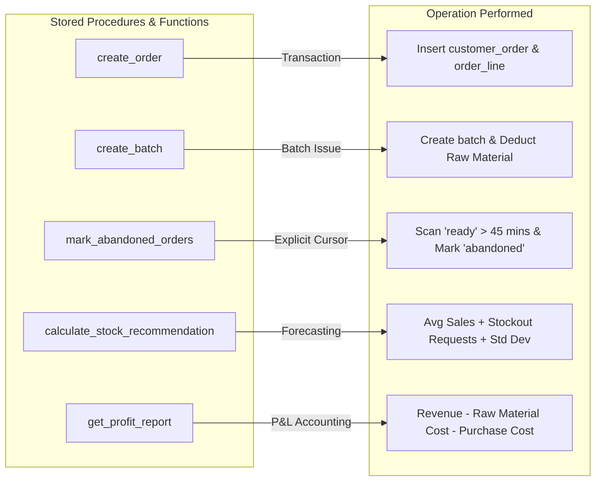
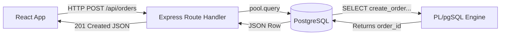

# System Architecture & Technical Deep-Dive: Digitization of CDS (OvenFresh CDS)

This document provides a comprehensive, presentation-ready guide to the **Digitization of CDS (OvenFresh CDS)** project. It details the system architecture, database schema, PL/pgSQL functions, event-driven triggers, backend REST proxy design, and real-time frontend synchronization.

---

## 1. Executive System Overview & Architectural Philosophy

**OvenFresh CDS** is an enterprise-grade DBMS project designed for university cafeterias and dining halls. It handles high-concurrency Point-of-Sale (POS) transactions, kitchen display management, passive wall-mounted token displays, raw material and daily-expiry inventory control, and executive analytics.



### Architectural Principle: Database-Centric (Heavy PL/pgSQL) Architecture
Unlike traditional web applications where business logic is written in backend languages like Node.js or Python, **all core domain rules, stock calculations, financial reporting, order status transitions, and data validations are strictly enforced inside PostgreSQL**.

- **Database Layer**: Houses all state, constraint validations, stored procedures, triggers, cursors, and transactional boundaries.
- **Backend Layer (Express 5)**: A lightweight, non-blocking REST API proxy that delegates directly to PostgreSQL PL/pgSQL functions via `SELECT * FROM function_name(...)`.
- **Frontend Layer (React 19)**: A responsive, multi-screen user interface that polls backend endpoints and reflects real-time database state across POS, Kitchen, Token Display, Inventory, and Analytics screens.

---

## 2. Database Schema & Data Model (Tables & Constraints)

The database schema consists of **16 relational tables**, organized into four operational domains.



### 2.1 Table Breakdown

| Table Name | Primary Key | Key Attributes & Foreign Keys | Purpose & Business Rationale |
| :--- | :--- | :--- | :--- |
| **`vendor`** | `vendor_id` | `name`, `supplies_raw_materials`, `supplies_ready_expiry`, `supplies_ready_non_expiry` | Master record of suppliers categorized by item types supplied. |
| **`vendor_phone`** | `(vendor_id, phone_number)` | `vendor_id` (FK to `vendor`) | Multivalued attribute handling multiple contact numbers per vendor. |
| **`raw_material`** | `raw_material_id` | `name`, `unit` (kg, litre, pc), `current_stock`, `reorder_level`, `average_unit_cost` | Raw ingredients used by the kitchen for batch cooking. |
| **`menu_item`** | `menu_item_id` | `selling_price`, `is_prepared_in_kitchen`, `expires_daily`, `is_purchasable`, `request_mode`, `mode_limit` | Master product catalog supporting prepared food, non-expiry ready goods, and daily-expiry items. |
| **`ready_made_stock`** | `stock_id` | `menu_item_id` (FK, UNIQUE), `current_stock`, `reorder_level`, `average_unit_cost` | Tracks inventory for non-expiring packaged goods (e.g., canned drinks, chips). |
| **`ready_made_daily_stock`** | `daily_stock_id` | `menu_item_id` (FK), `stock_date`, `day_of_week` (Generated), `quantity_received`, `quantity_sold`, `quantity_wasted`, `average_unit_cost` | Tracks daily-perishable items (e.g., samosas, sandwiches). Uses a compound UNIQUE key `(menu_item_id, stock_date)`. |
| **`customer`** | `customer_id` | `name`, `phone`, `id_type` (`student`/`nid`), `id_number`, `is_temporary` | Tracks registered campus customers. Reserved default row `customer_id = 1` for anonymous guest purchases. |
| **`customer_order`** | `order_id` | `customer_id` (FK), `order_timestamp`, `total_paid`, `payment_method` (`cash`/`mobile`), `status`, `last_status_update`, `dine_in_takeaway` | Core order header table. Status state machine: `paid` $\rightarrow$ `preparing` $\rightarrow$ `ready` $\rightarrow$ `served` / `abandoned` / `completed`. |
| **`order_line`** | `order_line_id` | `order_id` (FK), `menu_item_id` (FK), `batch_id` (FK), `quantity`, `unit_price_snapshot`, `unit_cost_at_time` | Itemized line items for customer orders with point-in-time price and cost snapshots. |
| **`kitchen_batch_issue`** | `batch_id` | `menu_item_id` (FK), `issued_at`, `status` (`preparing`/`available`/`exhausted`) | Tracks batches of food prepared in the kitchen. |
| **`kitchen_batch_issue_line`** | `line_id` | `batch_id` (FK), `raw_material_id` (FK), `quantity_taken`, `unit_cost_at_time` | Raw material quantities deducted when a batch is issued. |
| **`kitchen_request`** | `request_id` | `order_id` (FK, NULLable), `menu_item_id` (FK), `requested_quantity`, `status` (`pending`/`approved`/`rejected`), `approved_quantity` | Kitchen escalation requests triggered when bulk orders exceed the item's `mode_limit`. |
| **`stockout_request`** | `request_id` | `menu_item_id` (FK), `request_date`, `day_of_week` (Generated), `quantity` | Logs unfulfilled customer demand (missed sales) when an item is out of stock. |
| **`stock_recommendation`** | `recommendation_id` | `menu_item_id` (FK), `target_day_of_week`, `recommended_quantity`, `weeks_considered` | Pre-calculated batch forecasting recommendations for kitchen prep by day of the week. |
| **`purchase_order`** | `purchase_order_id` | `vendor_id` (FK), `order_date`, `total_amount`, `notes` | Inventory restocking purchase order headers. |
| **`purchase_order_line`** | `line_id` | `purchase_order_id` (FK), `item_type` (`raw_material`/`ready_made`), `item_id`, `quantity`, `unit_cost` | Line items for purchases that trigger stock updates and cost re-averaging. |

### 2.2 Key Database Constraints & Integrity Rules
1. **Mode Limit Enforcement**:
   ```sql
   CONSTRAINT chk_mode_mode_limit CHECK (
       (request_mode = 'Low' AND mode_limit = 8) OR
       (request_mode = 'Mid' AND mode_limit = 4) OR
       (request_mode = 'High' AND mode_limit = 1)
   )
   ```
   *Reasoning*: Controls how many units a cashier can sell without kitchen approval (e.g., high-demand items like beef roast have a `High` demand mode with a limit of 1).

2. **Perishable vs Prepared Mutual Exclusivity**:
   ```sql
   CONSTRAINT chk_prepared_expiry CHECK (
       NOT (is_prepared_in_kitchen = TRUE AND expires_daily = TRUE)
   )
   ```
   *Reasoning*: Items prepared in the kitchen are tracked via live kitchen batches (`kitchen_batch_issue`), while vendor-supplied perishables are tracked via `ready_made_daily_stock`. An item cannot belong to both models simultaneously.

---

## 3. Event-Driven Database Triggers

The system relies on four PostgreSQL triggers to maintain data integrity, update stock in real-time, and compute moving cost averages.



### 3.1 `trg_order_status_timestamp`
- **Target**: `customer_order` (`BEFORE UPDATE`)
- **Function**: `fn_update_order_status_timestamp()`
- **Logic**: Automatically sets `NEW.last_status_update = NOW()` whenever `NEW.status IS DISTINCT FROM OLD.status`.
- **Reasoning**: Ensures accurate timestamping for SLA monitoring and automated order abandonment detection.

### 3.2 `trg_purchase_stock_update`
- **Target**: `purchase_order_line` (`AFTER INSERT`)
- **Function**: `fn_purchase_stock_update()`
- **Logic & Weighted Average Cost Formula**:
  When new inventory is received, the trigger recalculates the **Weighted Average Unit Cost (WAC)** to accurately reflect cost changes across volatile supplier prices:
  $$\text{New Avg Cost} = \frac{(\text{Current Stock} \times \text{Current Avg Cost}) + (\text{Received Qty} \times \text{Purchase Unit Cost})}{\text{Current Stock} + \text{Received Qty}}$$
- **Handling**:
  - Updates `raw_material` stock and `average_unit_cost`.
  - Updates `ready_made_stock` for non-expiring goods.
  - Performs an `UPSERT` into `ready_made_daily_stock` for daily-expiring goods.
  - Automatically updates the parent `purchase_order.total_amount`.

### 3.3 `trg_batch_issue_deduction`
- **Target**: `kitchen_batch_issue_line` (`BEFORE INSERT`)
- **Function**: `fn_batch_issue_deduction()`
- **Logic**:
  - Takes a snapshot of the current `raw_material.average_unit_cost` into `NEW.unit_cost_at_time`.
  - Subtracts `NEW.quantity_taken` from `raw_material.current_stock`.
  - If stock is insufficient, it sets stock to zero, logs a `NOTICE`, and caps `quantity_taken` at the remaining stock.
- **Reasoning**: Ensures exact cost allocation per batch based on the material's cost at the exact moment of preparation.

### 3.4 `trg_sale_stock_deduction`
- **Target**: `order_line` (`BEFORE INSERT`)
- **Function**: `fn_sale_stock_deduction()`
- **Logic**:
  - **Kitchen Items**: Verifies that a valid `batch_id` is supplied and that the batch status is `'available'`.
  - **Non-Expiry Ready-Made Items**: Deducts `NEW.quantity` directly from `ready_made_stock.current_stock` and snapshots `unit_cost_at_time`.
  - **Daily Expiry Ready-Made Items**: Increments `ready_made_daily_stock.quantity_sold` for `CURRENT_DATE` and snapshots `unit_cost_at_time`.

---

## 4. PL/pgSQL Functions, Procedures & Explicit Cursors

All core operational tasks are packaged into PL/pgSQL functions.



### 4.1 Order & Cashier Processing
- **`get_cashier_products()`**:
  Returns a consolidated catalog of all purchasable menu items using a `UNION ALL` across prepared items, non-expiry ready-made items, and daily-expiry items. Determines real-time availability based on active kitchen batches or live inventory count.
- **`create_order(p_customer_id, p_payment_method, p_dine_takeaway, p_items)`**:
  Iterates over the JSON payload of items (`JSONB`), computes total bill amount, determines whether order status should be set to `'paid'` (needs kitchen preparation) or `'completed'` (only ready-made items), inserts into `customer_order`, and inserts into `order_line` (which fires `trg_sale_stock_deduction`).

### 4.2 Kitchen Operations & Escalation
- **`create_batch(p_menu_item_id, p_materials)`**:
  Creates a new batch in `kitchen_batch_issue` with status `'preparing'` and inserts required raw materials into `kitchen_batch_issue_line`.
- **`update_batch_status(p_batch_id, p_new_status)`**:
  Enforces state transitions (`preparing` $\rightarrow$ `available` $\rightarrow$ `exhausted`). Throws an exception on invalid status jumps.
- **`create_kitchen_request()`** & **`respond_to_kitchen_request()`**:
  Manages cashier-to-kitchen escalation requests when customer quantity exceeds the item's mode limit.

### 4.3 Automated Cleanup via Explicit PL/pgSQL Cursor
- **`mark_abandoned_orders()`**:
  Uses an **Explicit PL/pgSQL Cursor** to find uncollected orders and mark them as abandoned.

```sql
CREATE OR REPLACE FUNCTION mark_abandoned_orders() RETURNS INTEGER AS $$
DECLARE
  v_count INTEGER := 0;
  v_order_id INTEGER;
  abandoned_cursor CURSOR FOR
    SELECT order_id FROM customer_order
    WHERE status = 'ready'
    AND last_status_update < NOW() - INTERVAL '45 minutes';
BEGIN
  OPEN abandoned_cursor;
  LOOP
    FETCH abandoned_cursor INTO v_order_id;
    EXIT WHEN NOT FOUND;
    UPDATE customer_order SET status = 'abandoned' WHERE order_id = v_order_id;
    v_count := v_count + 1;
  END LOOP;
  CLOSE abandoned_cursor;
  RETURN v_count;
END;
$$ LANGUAGE plpgsql;
```
*Reasoning*: Demonstrates low-level cursor navigation in PostgreSQL. Orders left in `'ready'` state for longer than 45 minutes are marked `'abandoned'`, allowing management to log food loss.

### 4.4 Analytics & Intelligent Forecasting
- **`get_profit_report(p_start_date, p_end_date)`**:
  Executes Common Table Expressions (CTEs) to calculate revenue, cost of goods sold (COGS), and net profit split across prepared food and ready-made items.
- **`calculate_stock_recommendation(p_menu_item_id, p_weeks)`**:
  Computes safety stock recommendations using historical sales average, unfulfilled demand (`stockout_request`), and sample standard deviation ($\sigma$):
  $$\text{Recommended Prep Qty} = \lceil \text{Avg Sales} + \text{Avg Missed Demand} + \sigma_{\text{sales}} \rceil$$
- **`end_of_day_waste(p_date)`**:
  At day end, calculates wasted daily stock as $\text{Quantity Received} - \text{Quantity Sold}$ and updates `ready_made_daily_stock.quantity_wasted`.

---

## 5. Backend REST Proxy Architecture

The backend is built with **Node.js, Express 5, and TypeScript**. It acts as a lightweight communication link between the web interface and PostgreSQL.



### Route Design Pattern
Every endpoint calls a corresponding PL/pgSQL function:

1. **Order Creation**:
   ```typescript
   orderRoutes.post('/', async (req, res) => {
     const { customerId, paymentMethod, dineTakeaway, items } = req.body;
     const result = await pool.query(
       'SELECT create_order($1, $2, $3, $4) AS order_id',
       [customerId ?? 1, paymentMethod, dineTakeaway, JSON.stringify(items)]
     );
     res.status(201).json(result.rows[0]);
   });
   ```

2. **Financial Profit Report**:
   ```typescript
   analyticsRoutes.get('/profit', async (req, res) => {
     const { start, end } = req.query;
     const result = await pool.query(
       'SELECT * FROM get_profit_report($1, $2)',
       [start, end]
     );
     res.json(result.rows);
   });
   ```

---

## 6. Frontend Data Synchronization & Live Multi-Screen UX

The frontend is built with **React 19, Vite, and Tailwind CSS**. It features five dedicated user interfaces.

```mermaid
sequenceDiagram
    autonumber
    actor Cashier
    actor KitchenStaff
    actor Customer
    
    participant POS as Cashier POS (/pos)
    participant DB as PostgreSQL Database
    participant KDS as Kitchen Display (/kitchen)
    participant DISP as Token Display (/tokens)
    
    Cashier->>POS: Place order (Beef Roast x2)
    POS->>DB: POST /api/orders -> create_order()
    Note over DB: Triggers fire; Order status = 'paid'
    
    par Polling Loop (Every 2 seconds)
        KDS->>DB: GET /api/orders/board
        DISP->>DB: GET /api/orders/board
    end
    
    DB-->>KDS: Render ticket on KDS Board ("IN QUEUE")
    DB-->>DISP: Render token number under "IN QUEUE"
    
    KitchenStaff->>KDS: Click "Start Preparing"
    KDS->>DB: PATCH /api/orders/101/status -> 'preparing'
    DB-->>DISP: Token moves to "PREPARING" column
    
    KitchenStaff->>KDS: Click "Mark Ready"
    KDS->>DB: PATCH /api/orders/101/status -> 'ready'
    DB-->>DISP: Token moves to "NOW SERVING" + Green Glow & Animation
```

### 6.1 Real-Time Synchronization via `usePolling`
To keep screens in sync without setup complexity, the frontend uses a custom React hook that fetches updates on a 2-second interval and automatically pauses when the browser tab is hidden:

```typescript
export function usePolling<T>(fetcher: () => Promise<T>, intervalMs: number) {
  const [data, setData] = useState<T | null>(null);

  const refresh = useCallback(async () => {
    try {
      setData(await fetcherRef.current());
    } catch (e) { /* handle error */ }
  }, []);

  useEffect(() => {
    refresh();
    const id = setInterval(() => {
      if (!document.hidden) refresh(); // Saves CPU/network when tab is inactive
    }, intervalMs);
    return () => clearInterval(id);
  }, [refresh, intervalMs]);

  return { data, refresh };
}
```

### 6.2 Screen Descriptions & Functionality

1. **Cashier POS (`/pos`)**:
   - Displays real-time catalog fetched via `get_cashier_products()`.
   - Badges show live stock levels and kitchen batch statuses (`Available`, `Preparing`, `Exhausted`).
   - Automatically handles guest checkout (`customer_id = 1`) and registered student/phone lookup.
   - Detects mode limit breaches and creates a `kitchen_request` escalation item.

2. **Kitchen Display System KDS (`/kitchen`)**:
   - Renders orders in `paid` and `preparing` states.
   - Provides bump buttons to update statuses (`paid` $\rightarrow$ `preparing` $\rightarrow$ `ready`).
   - Displays pending escalation requests with One-Click **Approve / Reject** buttons.
   - Provides a **Create Batch** modal that lists raw material requirements.

3. **Token Display Wall (`/tokens`)**:
   - Passive wall display polling `/orders/board` every 2000ms.
   - Features 3 live columns: **NOW SERVING**, **PREPARING**, and **IN QUEUE**.
   - Triggers visual green glow animations whenever an order moves into `'ready'` status.

4. **Inventory Back-Office (`/inventory`)**:
   - Purchase order entry form that updates stock and recalculates Weighted Average Costs in real time via database triggers.
   - Raw material monitoring with reorder alert indicators.
   - Daily-expiry stock tracking with End-of-Day waste logging (`end_of_day_waste()`).

5. **Executive Dashboard (`/analytics`)**:
   - Profit & Loss charts powered by CTE queries in `get_profit_report()`.
   - Peak hours histogram displaying order volume by hour.
   - Top selling items vs. top missed-demand items (`stockout_request`).
   - Automated inventory prep recommendations computed via standard deviation metrics.

---

## 7. Key Presentation Talking Points & Defense Q&A

When presenting this project, highlight these core points to demonstrate technical depth:

### Talking Point 1: Why put business logic inside PostgreSQL (PL/pgSQL)?
- **Data Integrity & Consistency**: Storing logic in PL/pgSQL prevents inconsistent state changes, even if multiple client applications access the database at the same time.
- **Atomic Execution**: Operations like checking raw material levels, creating a kitchen batch, deducting inventory, and calculating unit costs happen inside single, atomic database transactions.
- **Zero Duplication**: Business logic is written once in PostgreSQL, so any backend service can safely connect without re-implementing rules.

### Talking Point 2: How does inventory costing work when supplier prices fluctuate?
- We implement **Weighted Average Costing (WAC)** inside `trg_purchase_stock_update`. Every time a purchase order line is received, the database recalculates the item's average cost before updating stock.

### Talking Point 3: How does the system handle bulk orders that might overload the kitchen?
- Every menu item has a `request_mode` (`Low`, `Mid`, `High`) mapped to a `mode_limit` (8, 4, or 1 unit). If a cashier tries to sell more than the allowed limit, the database forces a `kitchen_request` escalation that requires kitchen staff approval before the order can be processed.

### Talking Point 4: How are abandoned uncollected meals handled?
- We use an **Explicit PL/pgSQL Cursor** in `mark_abandoned_orders()`. It scans orders that have been in the `'ready'` state for over 45 minutes and updates their status to `'abandoned'`.

### Talking Point 5: How are multi-screen displays kept in sync?
- The backend serves state directly from PostgreSQL queries (`get_kitchen_orders()`, `/orders/board`), while the React frontend uses background-aware polling (`usePolling`). Changes made at the POS appear on the Kitchen display within two seconds, and updating an order status in the Kitchen updates the Token Display automatically.
